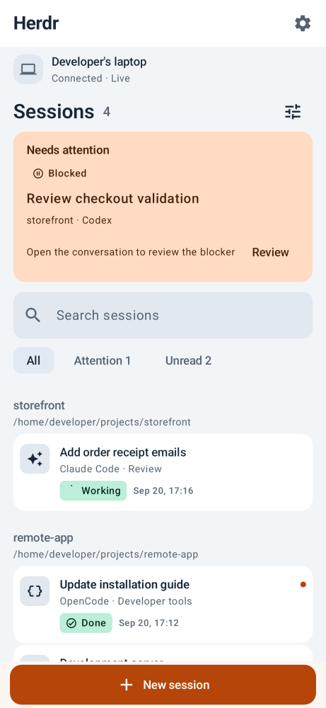
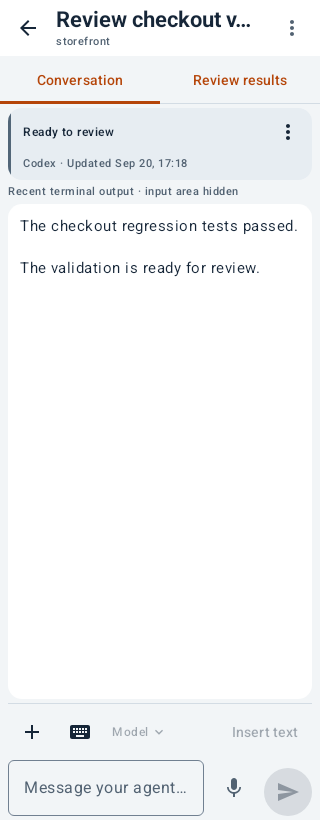
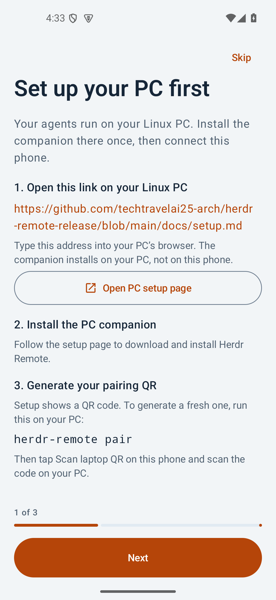

# Herdr Remote

An Android companion for [Herdr](https://github.com/herdrdev/herdr). Read agent conversations, answer questions, send prompts, review changes, and start sessions on your own Linux computer.

[Download the Android APK](https://github.com/techtravelai25-arch/herdr-remote-release/releases/latest/download/herdr-remote.apk) · [Release notes](docs/release-notes.md) · [Laptop setup](docs/setup.md)

## Quick start

1. Install the [Android APK](https://github.com/techtravelai25-arch/herdr-remote-release/releases/latest/download/herdr-remote.apk) on your phone (Android 8.0+).
2. Install [Herdr](https://github.com/herdrdev/herdr) and your coding agents on your Linux PC. This release is tested with Herdr 0.9.0.
3. Follow [laptop setup](docs/setup.md) to set up the companion and display your pairing QR.
4. In the app, tap **Scan laptop QR** and scan the code shown on your PC.

The setup guide covers the PC requirements and connection steps. The standard APK uses QR pairing; [cloud features](portal/README.md) are optional.

Version **0.8.34 (69)** installs as `dev.herdr.remote.community` and updates community 0.8.26 in place. The matching laptop companion is 0.8.34 (sequence 70). An older community APK with a different signer requires a fresh installation and pairing. See [release verification](docs/releases.md).

## What works

- Live terminal output plus a clean, read-only Claude, Codex, and OpenCode transcript with earlier-message paging.
- Prompts and terminal keys, model switching, session management, Git review, and file transfers.
- Codex question cards with the full question and selectable answers, including questions asked when a session opens. **Other** accepts a custom answer; questions without choices show a typed-answer field. Claude and OpenCode questions use the visible terminal and keys.
- Project file browsing and private, read-only text previews.
- Local HTML previews: tap an HTML result link or an HTML file in Files/Results. Nearby styles, images, and scripts load through the paired laptop connection. See [HTML previews](docs/html-previews.md).
- Claude and Codex usage for each account, and phone notifications that clear when you read the reply on the PC.
- Per-device permissions, saved PCs, signed companion updates, and optional cloud push.

Keep your PC awake and online, and update both the app and the companion for new controls.

## Screenshots

<table>
  <tr>
    <th>Sessions</th>
    <th>Agent conversation</th>
    <th>Laptop setup</th>
  </tr>
  <tr>
    <td></td>
    <td></td>
    <td></td>
  </tr>
</table>

Sessions and conversation images are native UI previews with example data. Laptop setup is captured from the community APK.

## Development

```sh
npm ci --prefix bridge
npm test --prefix bridge
npm ci --prefix portal
npm run types --prefix portal
npm run check --prefix portal
npm test --prefix portal
```

Android builds require JDK 17 and Android SDK 36. See [Android builds](android/README.md), [contributing](CONTRIBUTING.md), [security and data handling](SECURITY.md), and the [release process](docs/releases.md).

## Release publishing

Publish source updates and releases to this repository only as **techtravelai25-arch**. Use that name for both Git author and committer, with the account email `334168460+techtravelai25-arch@users.noreply.github.com`. Authenticate pushes and release updates with the same GitHub account. See [repository instructions](AGENTS.md).

## License

Original code is licensed under AGPL-3.0-or-later; see [LICENSE](LICENSE) and [NOTICE](NOTICE). Dependencies retain their own terms, recorded in [third-party notices](THIRD_PARTY_NOTICES.md). Herdr and the supported agents are separate projects. This is not an official product of their vendors.
